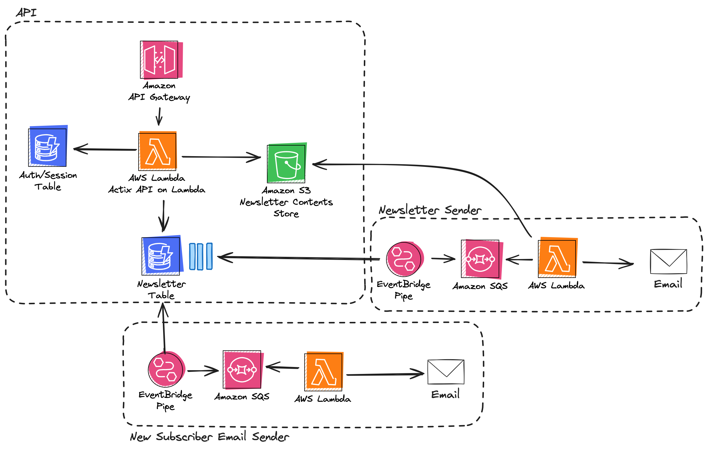

# Zero to Production Rust - The Serverless One

As an aspiring Rust developer, I found an incredible amount of value in [Luca Palmieri](https://twitter.com/algo_luca) book Zero to Production Rust. Frankly, it's one of the best programming books I've ever read, let alone Rust ones.

After finishing the book, I decided to take the final application and make it run using completely serverless technologies. The system in the book is a single process application, that interacts with a Postgres database and uses Redis as a session store. The serverless version, looks something like this...



Subscriber data is stored directly in DynamoDB, as well as subscription confirmation tokens. When a confirmation token is stored, Amazon EventBridge Pipes reads from the DynamoDB stream and stores a message in an Amazon SQS queue. A Lambda function reads from the queue and sends the email to the new subscriber.

When a newsletter issue is sent, newsletter body contents is stored in S3 (to handle large newsletter contents) and a pointer is stored in DynamoDB.An Amazon EventBridge Pipe is reading from the DynamoDB stream and storing a message in an AmazonSQS queue. A second Lambda function is listening to the queue send out newsletter emails. Both email sending functions are in the same Rust application to share the logic for sending emails. Think of this as an email-sending microservice.

## Distributed Tracing

The application is fully OpenTelemetry compatible, currently configured to export trace data to Jaeger when running locally and to Honeycomb when running in AWS. OpenTelemetry configuration is found in the [telemetry.rs](./src/api/src/telemetry.rs). When running inside Lambda, trace data is flushed using the `force_flush()` function after every request is processed. You can see an example using [Axum Middleware](./src/api/src/middleware.rs) or as part of a [Lambda function handler](./src/backend/src/bin/lambda/send_confirmation.rs). The backend handlers processing the DynamoDB stream also support trace propagation, to continue a trace from the API call through to the backend process.

## Configuration

Application configuration is provided using either environment variables, or configuration YML files. To add configuration, create a folder name `configuration` under `./src/api` and `./src/backend`. The code to load configuration data is found in [configuration.rs](./src/api/src/configuration.rs).

To configure your application, you can use files named:

- base.yaml: Applies to all environments
- local.yaml: Only applies to local execution
- production.yaml: Only applies when the container image is built

A complete configuration is found below, you can split up as required.

```yaml
application:
  application_port: 8080 # Local port to start on
  host_name: 0.0.0.0 # Host name to use
  hmac_secret: "super-long-and-secret-random-key-needed-to-verify-message-integrity"  # Secret key to used for HMAC encryption
database:
  database_name: "newsletter" # Name of DynamoDB table for newsletter and subscriber data
  auth_database_name: "auth" # Name of DynamoDB table for authentication
  use_local: true # Configure DynamoDB local
  newsletter_storage_bucket: "" # S3 Bucket name for storing newsletter metadata
telemetry:
  otlp_endpoint: "jaeger"  # Endpoint to send OTLP data to, set to Jaeger to use the local Jaeger exporter
  honeycomb_api_key: "" # API Key if sending trace data to Honeycomb
  dataset_name: "zero2prod-api" # The trace dataset name
email_settings:
  base_url: "https://api.postmarkapp.com" # URL to use for sending emails
  sender_email: "" # Email address to send emails from
  authorization_token: "" # Postmark authentication token
  timeout_milliseconds: 10000 # Mail server timeout
```

A future feature is to replace this with AWS System Manager Parameter Store.

## Test

To test locally first ensure you have Docker up and running. Then:

1. Execute script under [src/api/scripts/init_db.sh](./src/api/scripts/init_db.sh). This starts local Docker containers and creates DynamoDB tables in DynamoDB Local
2. Execute `cargo test` in either the [api](./src/api) or [backend](./src/backend/) folder to run tests
3. Run `cargo run` in the [api](./src/api) folder to startup the Axum application locally


## Local Run

When you start the application up for the first time, make a GET request to `/util/_migrate`. This will create the initial admin user, with a password of `James!23`. **IMPORTANT! If deploying to AWS ensure you immediately login and change the admin user password**

Once the migrate endpoint is executed, you can interact with the API

*TODO! Add API endpoint examples*

## Deploy

The API and backend are both deployed together in a single CDK stack. This is to simplify deployment. In production, this would split into 2 separate stacks for 2 separate microservices.

## Future Development

- [X] Introduce EventBridge Pipes to decouple DynamoDB stream from backend processors
- [X] Introduce SQS to improve durability
- [ ] Add error handling at integration points (DLQ etc)
- [ ] Implement StepFunctions to manage email sending, to iterate over list of subscribers
- [ ] Add SSM for parameter storage
- [ ] Add CICD pipelines to demonstrate CICD best practices
